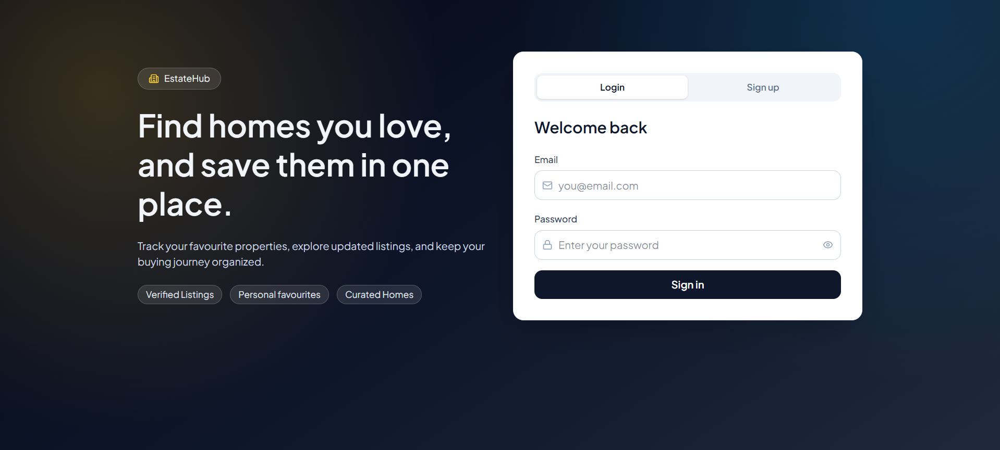
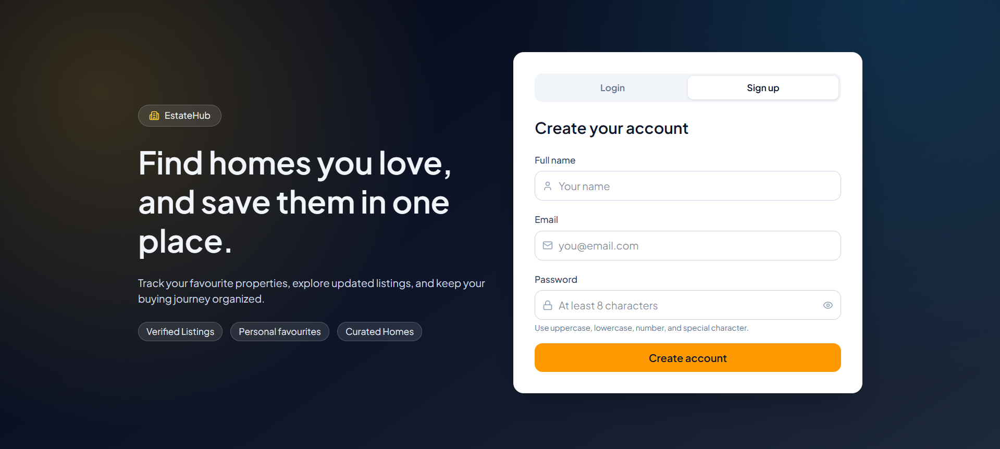
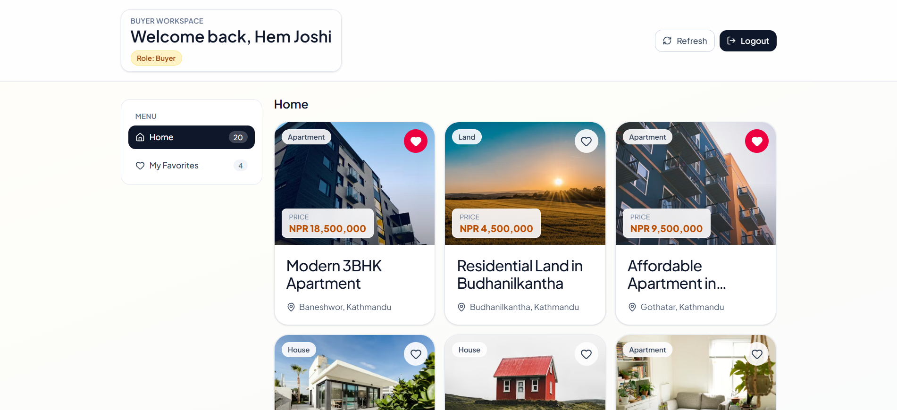
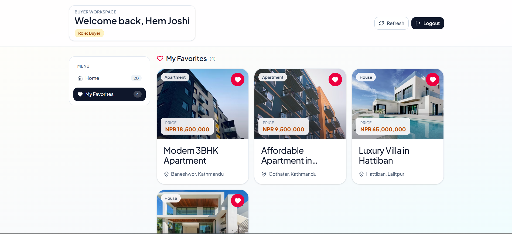
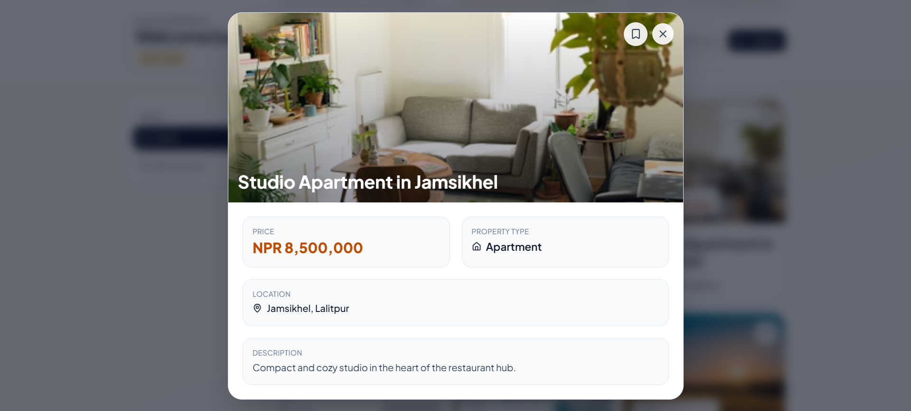

<h1>
	
	Real Estate Buyer Portal
</h1>

A full-stack buyer portal for real-estate users to register, login, browse property listings, and manage personal favourites.

- Repository: [https://github.com/HemJoshi111/real-estate-buyer-portal](https://github.com/HemJoshi111/real-estate-buyer-portal)

## Live Demo

- Production App: [https://real-estate-buyer-portal.vercel.app/](https://real-estate-buyer-portal.vercel.app/)

## Overview

This project implements a practical buyer workflow with secure authentication and a personalized dashboard:

- User signup and login with JWT-based authentication
- Protected dashboard with buyer profile context
- Property catalog and personal favourites management
- Add/remove favourite actions with per-user ownership enforcement
- Modern responsive UI for auth, listing cards, and property detail modal

## Key Features

### Authentication

- Register with `name`, `email`, and `password`
- Login with email and password
- Password hashing via `bcryptjs` (no plain-text password storage)
- JWT token generation and protected API middleware
- Client-side auth persistence and logout flow

### Buyer Dashboard

- Personalized greeting with user name and role
- Sticky sidebar menu (`Home`, `My Favorites`)
- Property cards with favourite toggles
- Popup/modal property detail view
- Toast notifications for add/remove favourite and errors

### Favourites

- Toggle favourite on any property
- "My Favorites" view filtered per authenticated user
- Backend checks ensure users only access/modify their own favourites

## Tech Stack


-7C3AED.svg>)

### Stack Details

### Frontend

- React + Vite
- React Router
- Tailwind CSS
- Lucide React icons

### Backend

- Node.js + Express
- MongoDB + Mongoose
- JWT (`jsonwebtoken`)
- Password hashing (`bcryptjs`)

## Project Structure

```text
buyer-portal/
├── client/                  # React frontend
│   ├── src/
│   │   ├── api/
│   │   ├── components/
│   │   ├── context/
│   │   ├── hooks/
│   │   └── pages/
│   └── package.json
├── server/                  # Express API
│   ├── config/
│   ├── controllers/
│   ├── middleware/
│   ├── models/
│   ├── routes/
│   └── package.json
└── README.md
```

## Getting Started - How to Run Locally

## 1. Clone the repository

```bash
git clone https://github.com/HemJoshi111/real-estate-buyer-portal.git
cd real-estate-buyer-portal
```

## 2. Install dependencies

Install backend dependencies:

```bash
cd server
npm install
```

Install frontend dependencies:

```bash
cd ../client
npm install
```

## 3. Configure environment variables

Inside `server/`, create a `.env` file:

```env
PORT=5000
MONGO_URI=your_mongodb_connection_string
JWT_SECRET=your_secure_jwt_secret
```

Inside `client/`, create a `.env` file:

```env
VITE_API_BASE_URL=http://localhost:5000/api
```

## 4. Seed sample property data (optional)

```bash
cd server
npm run seed
```

## 5. Run the backend

```bash
cd server
npm run dev
```

Backend runs at: `http://localhost:5000`

## 6. Run the frontend

Open a new terminal:

```bash
cd client
npm run dev
```

Frontend runs at: `http://localhost:5173`

## 7. Open in browser

Go to:

`http://localhost:5173`

## Available Scripts

### Backend (`server/`)

- `npm run dev` - Start server with nodemon
- `npm start` - Start server with node
- `npm run seed` - Seed property data

### Frontend (`client/`)

- `npm run dev` - Start Vite dev server
- `npm run build` - Build production assets
- `npm run preview` - Preview production build
- `npm run lint` - Run ESLint

## API Summary

Base URL: `http://localhost:5000/api`

### User Routes

- `POST /users/register` - Register new user
- `POST /users/login` - Login user
- `GET /users/profile` - Get authenticated profile (protected)
- `POST /users/logout` - Logout endpoint (protected)

### Property Routes

- `GET /properties` - Get all properties
- `GET /properties/:id` - Get property details

### Favourite Routes

- `GET /favorites/my` - Get current user's favourites (protected)
- `POST /favorites/toggle` - Add/remove favourite (protected)

## Example End-to-End Flow

1. Open app on `http://localhost:5173`
2. Sign up with name, email, password
3. Login and access dashboard
4. Browse properties under `Home`
5. Click heart icon to add/remove favourites
6. Open `My Favorites` to view only saved properties
7. Open card modal for full property details
8. Logout from dashboard

## Example Flows

### Flow 1: New User Onboarding

1. Open the app (`http://localhost:5173`).
2. Switch to `Sign up`.
3. Enter `name`, `email`, and `password`.
4. Submit the form to create your account.
5. You are authenticated and redirected to the dashboard.

### Flow 2: Login + Add Favourite

1. Open the app and choose `Login`.
2. Sign in with your registered email and password.
3. On `Home`, browse properties.
4. Click the heart icon on any property card.
5. A success toast appears, and the property is added to your favourites.

### Flow 3: View and Remove Favourite

1. From dashboard, open `My Favorites` in the sidebar.
2. Confirm your liked properties are listed.
3. Click the heart icon again on a saved property.
4. A success toast appears, and the property is removed.

### Flow 4: Property Detail Modal

1. Click any property card (image or content area).
2. A popup/modal opens with full details.
3. You can add/remove favourite directly from the modal.
4. Close the modal with the `X` button, backdrop click, or `Esc` key.

### Flow 5: Secure Logout

1. Click `Logout` from the dashboard header.
2. Auth state is cleared on client (and logout endpoint is called).
3. You are redirected to the login screen.

## Screenshots (Current UI)

### Login



### Signup



### Dashboard (Home)



### Dashboard (My Favorites)



### Property Details Modal



## Security Notes

- Passwords are hashed before saving (`bcryptjs`)
- JWT is used for protected route authorization
- User-specific favourites are enforced server-side using authenticated user context

## Author

[](https://github.com/HemJoshi111)
